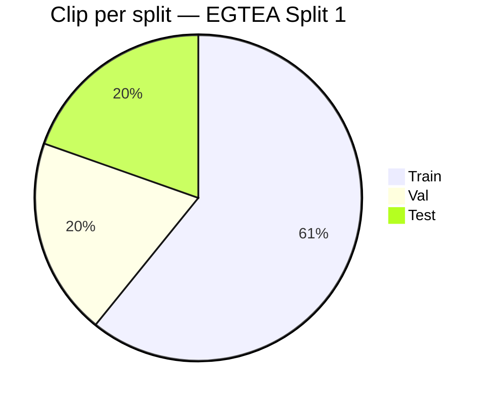

<<<<<<< HEAD
# Documentazione progetto

## Scopo

Questo progetto implementa un flusso completo per la segmentazione temporale delle azioni su video EGTEA Gaze+. L'obiettivo e' predire una label densa frame-per-frame, stimando quando ogni azione inizia e finisce all'interno di una sequenza temporale lunga.

L'idea centrale e' trasformare feature video gia' estratte in sequenze di predizioni temporali usando modelli diversi, cosi' da confrontare approcci piu' semplici e architetture piu' recenti.

## Struttura del repository

- `train.py`: entry point per l'addestramento.
- `evaluate.py`: analisi qualitativa degli errori sistematici su un checkpoint.
- `explore_dataset.py`: analisi statistica del dataset e produzione di grafici.
- `visualize_samples.py`: visualizzazione di esempi del training set.
- `visualize_split.py`: grafici della divisione train/val/test (clip, classi, durate).
- `configs/base.yaml`: impostazioni condivise di dati e training.
- `configs/xlstm.yaml`, `configs/lstm.yaml`, `configs/cnn1d.yaml`, `configs/mamba.yaml`: config per modello, ereditano `base.yaml`.
- `data/`: dataset, lettura da LMDB e datamodule PyTorch Lightning.
- `models/`: implementazioni dei modelli CNN1D, LSTM, xLSTM e Mamba.
- `training/`: LightningModule, loss e metriche di validazione.
- `action_annotation/`: split e annotazioni EGTEA Gaze+.
- `eval/`: output salvati dagli script di valutazione.

## Flusso dei dati

1. Le feature RGB vengono lette da un archivio LMDB precomputato.
2. Le annotazioni di EGTEA vengono convertite in label dense a livello di frame.
3. Il dataset costruisce finestre temporali di lunghezza fissa `seq_len`.
4. In training vengono usati crop casuali.
5. In validation viene usato uno sliding window per coprire l'intero clip con sovrapposizione controllata.
6. Il modello produce logits per ogni frame.
7. Il LightningModule calcola loss e metriche frame-level e segment-level.

## Dataset

La logica principale e' in `data/dataset.py`.

Il dataset:

- legge gli split con `load_split()`;
- legge le annotazioni dense con `load_action_labels()`;
- mappa il tempo in millisecondi su frame assumendo `24 fps`;
- costruisce label frame-by-frame con background come classe `0`;
- supporta RGB e, opzionalmente, flow;
- gestisce sequenze piu' corte di `seq_len` con padding.

La classe `EGTEADataset` supporta due modalita':

- `sliding_window=False`: crop casuale, usato per training;
- `sliding_window=True`: finestre sovrapposte, usate per validation e test piu' accurati.

### Perche' la sliding window in validazione

Il modello accetta sequenze di lunghezza fissa (`seq_len=128` frame, ~5 secondi). I clip EGTEA pero' durano in media molto di piu'. Se in validazione si estraesse un solo crop casuale per clip, si valuterebbe solo una porzione del clip, e la scelta casuale renderebbe le metriche non riproducibili e potenzialmente distorte.

La sliding window risolve il problema scorrendo l'intera durata del clip con finestre sovrapposte:

```
Clip:  |-----------------------------------------------|
       seq_len=128          stride=64

Win 1: |-----128-----|
Win 2:         |-----128-----|
Win 3:                 |-----128-----|
...
```

Con `stride=64` e `seq_len=128` si ha una sovrapposizione del 50% tra finestre consecutive. L'ultima finestra viene sempre aggiustata per coprire fino alla fine del clip, evitando di perdere gli ultimi frame.

In training invece il crop casuale e' preferibile: introduce variabilita' sulla posizione della finestra ad ogni epoca, che funziona come una forma di data augmentation temporale e riduce il rischio di memorizzare la posizione assoluta delle azioni nel clip.

## DataModule

`data/datamodule.py` incapsula la preparazione dei dataset in PyTorch Lightning.

Durante `setup()`:

- viene creato il training set con crop casuali;
- viene creato il validation set con sliding window;
- i path LMDB vengono costruiti a partire da `egtea_root` e dallo split selezionato.

Questo rende il training ripetibile e tiene separata la logica di caricamento dati dal resto del codice.

### Divisione train / val / test

Il dataset EGTEA Gaze+ usa lo split ufficiale per il test. La validazione viene ricavata dal training set con un seed fisso, a livello di clip (nessun frame condiviso tra train e val).



| Split | Clip | Finestre (seq=128, stride=64) | Modalita' |
|-------|-----:|------------------------------:|-----------|
| Train | 6 277 | 1 per epoch (crop casuale) | random crop |
| Val   | 2 022 | ~3–4 per clip (sliding window) | sliding window |
| Test  | ~2 022 | ~3–4 per clip (sliding window) | sliding window |

La val e' estratta dai clip di training con `split_seed=42` e `val_size=2022`. Il test proviene da `test_split1.txt`, separato in fase di raccolta del dataset. Questa separazione a livello di clip garantisce che nessun frame di training compaia in validazione.

## Modelli

Tutti i modelli condividono l'interfaccia `Input: (B, T, feat_dim)` e `Output: (B, T, num_classes)`.

### CNN1D

`models/cnn1d.py` implementa una baseline temporale con convoluzioni 1D lungo l'asse tempo. E' la soluzione piu' semplice e serve come riferimento.

### LSTM

`models/lstm.py` usa una LSTM bidirezionale opzionale per catturare dipendenze temporali e contesto sequenziale.

### xLSTM

`models/xlstm.py` prova a usare la libreria ufficiale `xlstm` se disponibile; altrimenti cade su un fallback manuale. Questo rende il progetto piu' portabile, anche se la parte fallback e' piu' sperimentale rispetto a una implementazione industriale.

### Mamba

`models/mamba.py` contiene una implementazione PyTorch pura di un blocco state-space selettivo ispirato a Mamba. L'idea e' gestire sequenze lunghe in modo piu' efficiente rispetto a RNN o attention classica.

## Training

L'entry point e' `train.py`.

Il comportamento e' il seguente:

- carica `configs/base.yaml`;
- permette override da riga di comando nel formato `chiave.sottochiave=valore`;
- costruisce il datamodule;
- istanzia il modello scelto tramite `model.name`;
- wrappa il modello in `TemporalSegmentationModule`;
- usa `WandbLogger` per logging e tracking;
- salva i checkpoint migliori monitorando `val/edit_score`;
- usa `EarlyStopping` e `LearningRateMonitor`.

La loss totale combina tre termini:

- cross-entropy con label smoothing;
- smooth loss per penalizzare transizioni troppo brusche dove il GT non cambia;
- boundary loss per dare piu' peso agli errori vicino ai confini delle azioni.

## Metriche

Il modulo in `training/module.py` calcola metriche sia frame-level sia segment-level.

Metriche principali:

- accuracy globale;
- accuracy sulle classi foreground (`acc_fg`);
- mIoU epoch-level (solo classi foreground);
- F1 a soglie `10`, `25`, `50`;
- edit score (distanza di Levenshtein tra sequenze di segmenti);
- boundary F1 con tolleranza di 2 frame.

Questa combinazione e' utile perche' la segmentazione temporale non si valuta bene con la sola accuracy frame-level.

### Cosa viene loggato per stage

Non tutte le metriche sono utili in ogni fase. Le loss in test non aggiungono informazione (il modello non si aggiorna), e alcune metriche sono ridondanti fuori dal training.

| Metrica | Train | Val | Test |
|---|:---:|:---:|:---:|
| loss (totale) | ✓ | ✓ | — |
| loss_ce | ✓ | ✓ | — |
| loss_smooth | ✓ | — | — |
| loss_boundary | ✓ | — | — |
| acc_fg | ✓ | ✓ | — |
| mIoU | ✓ | ✓ | ✓ |
| edit_score | ✓ | ✓ | ✓ |
| F1@10 / F1@25 / F1@50 | — | ✓ | ✓ |
| boundary_f1 | — | ✓ | ✓ |

In val si tengono `loss` e `loss_ce` perche' il gap rispetto al train e' il segnale principale di overfitting. In test servono solo le metriche di valutazione finale.

## Valutazione qualitativa

`evaluate.py` serve a capire gli errori sistematici di un modello gia' addestrato.

Lo script:

- carica la config base;
- ricrea il modello corretto;
- carica il checkpoint `.ckpt`;
- esegue inference su un numero di clip configurabile;
- confronta predizioni e ground truth;
- misura ritardo e anticipo sui confini delle azioni;
- salva plot dei clip e distribuzioni degli errori.

L'output principale e' pensato per rispondere a domande del tipo: il modello arriva in ritardo sulla fine dell'azione? confonde classi simili? sbaglia soprattutto i confini?

## Analisi esplorativa

`explore_dataset.py` genera una panoramica statistica del dataset:

- distribuzione background/foreground;
- durata dei clip;
- distribuzione delle classi foreground;
- analisi dello sbilanciamento;
- grafici salvati come PNG nella root del progetto.

`visualize_samples.py` mostra esempi del training set combinando:

- barra delle label temporali;
- proiezione PCA delle feature;
- distribuzione delle classi nel clip.

## Configurazione principale

I config sono divisi in due livelli:

- `configs/base.yaml`: impostazioni condivise (data, training). Non contiene la sezione `model`.
- `configs/<modello>.yaml`: impostazioni specifiche del modello e nome del run W&B. Ogni file dichiara `base: configs/base.yaml` e `train.py` esegue il merge automatico.

I config disponibili sono `xlstm.yaml`, `lstm.yaml`, `cnn1d.yaml`, `mamba.yaml`.

Per modificare un iperparametro condiviso (es. `batch_size`, `lr`) si edita `base.yaml`. Per modificare qualcosa di specifico a un modello si edita il file corrispondente. E' possibile fare override da riga di comando senza toccare i file.

## Output generati

Durante il lavoro il progetto produce diversi artefatti:

- checkpoint in `temporal-action-segmentation/<run_id>/checkpoints/`;
- log e metadati in `wandb/`;
- figure di analisi come `dataset_analysis.png`, `clip_duration_analysis.png`, `class_distribution.png`, `training_samples.png`;
- output di evaluation in `eval/eval_<model>/`.

## Note pratiche

- I path del dataset sono hardcoded in diversi script di analisi, quindi vanno adattati all'ambiente locale prima dell'esecuzione.
- Il progetto assume feature gia' estratte, non video raw.
- `evaluate.py` e gli script di analisi usano la configurazione base come fonte unica di alcuni parametri.
- Il modulo di training e' impostato per lavorare con CUDA.

## Come eseguire

Training:

```bash
python train.py
```

Override di un parametro:

```bash
python train.py model.name=lstm
```

Analisi dataset:

```bash
python explore_dataset.py
```

Visualizzazione campioni:

```bash
python visualize_samples.py --n_clips 4 --seed 42
```

Valutazione qualitativa:

```bash
python evaluate.py --checkpoint path/to/checkpoint.ckpt --model mamba
```

## Sintesi finale

=======
# Documentazione progetto

## Scopo

Questo progetto implementa un flusso completo per la segmentazione temporale delle azioni su video EGTEA Gaze+. L'obiettivo e' predire una label densa frame-per-frame, stimando quando ogni azione inizia e finisce all'interno di una sequenza temporale lunga.

L'idea centrale e' trasformare feature video gia' estratte in sequenze di predizioni temporali usando modelli diversi, cosi' da confrontare approcci piu' semplici e architetture piu' recenti.

## Struttura del repository

- `train.py`: entry point per l'addestramento.
- `evaluate.py`: analisi qualitativa degli errori sistematici su un checkpoint.
- `explore_dataset.py`: analisi statistica del dataset e produzione di grafici.
- `visualize_samples.py`: visualizzazione di esempi del training set.
- `visualize_split.py`: grafici della divisione train/val/test (clip, classi, durate).
- `configs/base.yaml`: impostazioni condivise di dati e training.
- `configs/xlstm.yaml`, `configs/lstm.yaml`, `configs/cnn1d.yaml`, `configs/mamba.yaml`: config per modello, ereditano `base.yaml`.
- `data/`: dataset, lettura da LMDB e datamodule PyTorch Lightning.
- `models/`: implementazioni dei modelli CNN1D, LSTM, xLSTM e Mamba.
- `training/`: LightningModule, loss e metriche di validazione.
- `action_annotation/`: split e annotazioni EGTEA Gaze+.
- `eval/`: output salvati dagli script di valutazione.

## Flusso dei dati

1. Le feature RGB vengono lette da un archivio LMDB precomputato.
2. Le annotazioni di EGTEA vengono convertite in label dense a livello di frame.
3. Il dataset costruisce finestre temporali di lunghezza fissa `seq_len`.
4. In training vengono usati crop casuali.
5. In validation viene usato uno sliding window per coprire l'intero clip con sovrapposizione controllata.
6. Il modello produce logits per ogni frame.
7. Il LightningModule calcola loss e metriche frame-level e segment-level.

## Dataset

La logica principale e' in `data/dataset.py`.

Il dataset:

- legge gli split con `load_split()`;
- legge le annotazioni dense con `load_action_labels()`;
- mappa il tempo in millisecondi su frame assumendo `24 fps`;
- costruisce label frame-by-frame con background come classe `0`;
- supporta RGB e, opzionalmente, flow;
- gestisce sequenze piu' corte di `seq_len` con padding.

La classe `EGTEADataset` supporta due modalita':

- `sliding_window=False`: crop casuale, usato per training;
- `sliding_window=True`: finestre sovrapposte, usate per validation e test piu' accurati.

### Perche' la sliding window in validazione

Il modello accetta sequenze di lunghezza fissa (`seq_len=128` frame, ~5 secondi). I clip EGTEA pero' durano in media molto di piu'. Se in validazione si estraesse un solo crop casuale per clip, si valuterebbe solo una porzione del clip, e la scelta casuale renderebbe le metriche non riproducibili e potenzialmente distorte.

La sliding window risolve il problema scorrendo l'intera durata del clip con finestre sovrapposte:

```
Clip:  |-----------------------------------------------|
       seq_len=128          stride=64

Win 1: |-----128-----|
Win 2:         |-----128-----|
Win 3:                 |-----128-----|
...
```

Con `stride=64` e `seq_len=128` si ha una sovrapposizione del 50% tra finestre consecutive. L'ultima finestra viene sempre aggiustata per coprire fino alla fine del clip, evitando di perdere gli ultimi frame.

In training invece il crop casuale e' preferibile: introduce variabilita' sulla posizione della finestra ad ogni epoca, che funziona come una forma di data augmentation temporale e riduce il rischio di memorizzare la posizione assoluta delle azioni nel clip.

## DataModule

`data/datamodule.py` incapsula la preparazione dei dataset in PyTorch Lightning.

Durante `setup()`:

- viene creato il training set con crop casuali;
- viene creato il validation set con sliding window;
- i path LMDB vengono costruiti a partire da `egtea_root` e dallo split selezionato.

Questo rende il training ripetibile e tiene separata la logica di caricamento dati dal resto del codice.

### Divisione train / val / test

Il dataset EGTEA Gaze+ usa lo split ufficiale per il test. La validazione viene ricavata dal training set con un seed fisso, a livello di clip (nessun frame condiviso tra train e val).


| Split | Clip | Finestre (seq=128, stride=64) | Modalita' |
|-------|-----:|------------------------------:|-----------|
| Train | 6 277 | 1 per epoch (crop casuale) | random crop |
| Val   | 2 022 | ~3–4 per clip (sliding window) | sliding window |
| Test  | ~2 022 | ~3–4 per clip (sliding window) | sliding window |

La val e' estratta dai clip di training con `split_seed=42` e `val_size=2022`. Il test proviene da `test_split1.txt`, separato in fase di raccolta del dataset. Questa separazione a livello di clip garantisce che nessun frame di training compaia in validazione.

## Modelli

Tutti i modelli condividono l'interfaccia `Input: (B, T, feat_dim)` e `Output: (B, T, num_classes)`.

### CNN1D

`models/cnn1d.py` implementa una baseline temporale con convoluzioni 1D lungo l'asse tempo. E' la soluzione piu' semplice e serve come riferimento.

### LSTM

`models/lstm.py` usa una LSTM bidirezionale opzionale per catturare dipendenze temporali e contesto sequenziale.

### xLSTM

`models/xlstm.py` prova a usare la libreria ufficiale `xlstm` se disponibile; altrimenti cade su un fallback manuale. Questo rende il progetto piu' portabile, anche se la parte fallback e' piu' sperimentale rispetto a una implementazione industriale.

### Mamba

`models/mamba.py` contiene una implementazione PyTorch pura di un blocco state-space selettivo ispirato a Mamba. L'idea e' gestire sequenze lunghe in modo piu' efficiente rispetto a RNN o attention classica.

## Training

L'entry point e' `train.py`.

Il comportamento e' il seguente:

- carica `configs/base.yaml`;
- permette override da riga di comando nel formato `chiave.sottochiave=valore`;
- costruisce il datamodule;
- istanzia il modello scelto tramite `model.name`;
- wrappa il modello in `TemporalSegmentationModule`;
- usa `WandbLogger` per logging e tracking;
- salva i checkpoint migliori monitorando `val/edit_score`;
- usa `EarlyStopping` e `LearningRateMonitor`.

La loss totale combina tre termini:

- cross-entropy con label smoothing;
- smooth loss per penalizzare transizioni troppo brusche dove il GT non cambia;
- boundary loss per dare piu' peso agli errori vicino ai confini delle azioni.

## Metriche

Il modulo in `training/module.py` calcola metriche sia frame-level sia segment-level.

Metriche principali:

- accuracy globale;
- accuracy sulle classi foreground (`acc_fg`);
- mIoU epoch-level (solo classi foreground);
- F1 a soglie `10`, `25`, `50`;
- edit score (distanza di Levenshtein tra sequenze di segmenti);
- boundary F1 con tolleranza di 2 frame.

Questa combinazione e' utile perche' la segmentazione temporale non si valuta bene con la sola accuracy frame-level.

### Cosa viene loggato per stage

Non tutte le metriche sono utili in ogni fase. Le loss in test non aggiungono informazione (il modello non si aggiorna), e alcune metriche sono ridondanti fuori dal training.

| Metrica | Train | Val | Test |
|---|:---:|:---:|:---:|
| loss (totale) | ✓ | ✓ | — |
| loss_ce | ✓ | ✓ | — |
| loss_smooth | ✓ | — | — |
| loss_boundary | ✓ | — | — |
| acc_fg | ✓ | ✓ | — |
| mIoU | ✓ | ✓ | ✓ |
| edit_score | ✓ | ✓ | ✓ |
| F1@10 / F1@25 / F1@50 | — | ✓ | ✓ |
| boundary_f1 | — | ✓ | ✓ |

In val si tengono `loss` e `loss_ce` perche' il gap rispetto al train e' il segnale principale di overfitting. In test servono solo le metriche di valutazione finale.

## Valutazione qualitativa

`evaluate.py` serve a capire gli errori sistematici di un modello gia' addestrato.

Lo script:

- carica la config base;
- ricrea il modello corretto;
- carica il checkpoint `.ckpt`;
- esegue inference su un numero di clip configurabile;
- confronta predizioni e ground truth;
- misura ritardo e anticipo sui confini delle azioni;
- salva plot dei clip e distribuzioni degli errori.

L'output principale e' pensato per rispondere a domande del tipo: il modello arriva in ritardo sulla fine dell'azione? confonde classi simili? sbaglia soprattutto i confini?

## Analisi esplorativa

`explore_dataset.py` genera una panoramica statistica del dataset:

- distribuzione background/foreground;
- durata dei clip;
- distribuzione delle classi foreground;
- analisi dello sbilanciamento;
- grafici salvati come PNG nella root del progetto.

`visualize_samples.py` mostra esempi del training set combinando:

- barra delle label temporali;
- proiezione PCA delle feature;
- distribuzione delle classi nel clip.

## Configurazione principale

I config sono divisi in due livelli:

- `configs/base.yaml`: impostazioni condivise (data, training). Non contiene la sezione `model`.
- `configs/<modello>.yaml`: impostazioni specifiche del modello e nome del run W&B. Ogni file dichiara `base: configs/base.yaml` e `train.py` esegue il merge automatico.

I config disponibili sono `xlstm.yaml`, `lstm.yaml`, `cnn1d.yaml`, `mamba.yaml`.

Per modificare un iperparametro condiviso (es. `batch_size`, `lr`) si edita `base.yaml`. Per modificare qualcosa di specifico a un modello si edita il file corrispondente. E' possibile fare override da riga di comando senza toccare i file.

## Output generati

Durante il lavoro il progetto produce diversi artefatti:

- checkpoint in `temporal-action-segmentation/<run_id>/checkpoints/`;
- log e metadati in `wandb/`;
- figure di analisi come `dataset_analysis.png`, `clip_duration_analysis.png`, `class_distribution.png`, `training_samples.png`;
- output di evaluation in `eval/eval_<model>/`.

## Note pratiche

- I path del dataset sono hardcoded in diversi script di analisi, quindi vanno adattati all'ambiente locale prima dell'esecuzione.
- Il progetto assume feature gia' estratte, non video raw.
- `evaluate.py` e gli script di analisi usano la configurazione base come fonte unica di alcuni parametri.
- Il modulo di training e' impostato per lavorare con CUDA.

## Come eseguire

Training:

```bash
python train.py
```

Override di un parametro:

```bash
python train.py model.name=lstm
```

Analisi dataset:

```bash
python explore_dataset.py
```

Visualizzazione campioni:

```bash
python visualize_samples.py --n_clips 4 --seed 42
```

Valutazione qualitativa:

```bash
python evaluate.py --checkpoint path/to/checkpoint.ckpt --model mamba
```

## Sintesi finale

>>>>>>> 42c5e63ee0570321b67744f8b5f40cc8e0fffff0
Il repository e' una pipeline abbastanza completa per segmentazione temporale delle azioni: parte da feature preestratte, costruisce label dense, allena piu' architetture alternative, e fornisce strumenti per capire sia le prestazioni numeriche sia gli errori temporali sui confini delle azioni.